# UI and visual audit — the third instrument

`docs/OPEN-ITEMS.md` § "Backlog — UI and visual audit". Requested 2026-09-05, run the same day
against `main` at `8e67604` in worktree `worktree-agent-a182434ec2ad2363c`. **Read-and-report: no
source file was changed.** Dev server on `:5299`, driven in Chrome. Saves seeded through
`localStorage`, per `docs/FIX-REVIEW-CUT.md` §3.

Real window is 1680×836 CSS px. Larger and smaller windows are **simulated** by pinning `#root`
to the target box and scaling `<html>` with CSS `zoom`, per `docs/FIX-VIEWPORT.md` §4 —
`resize_window` does nothing in this environment. Geometry in those shots is exact in CSS pixels;
raster detail is not.

Findings are written in discovery order below and **ranked in the index at the end**. Each carries
**Confirmed** (photographed, or read off the accessibility tree) or **Suspected**.

---

## Findings, in discovery order

### F1 — The site map encodes the medal in ring hue alone. **Confirmed.**

**Screen:** Site map (`src/ui/screens/LevelSelect.tsx`, `src/ui/styles/screens.css`).

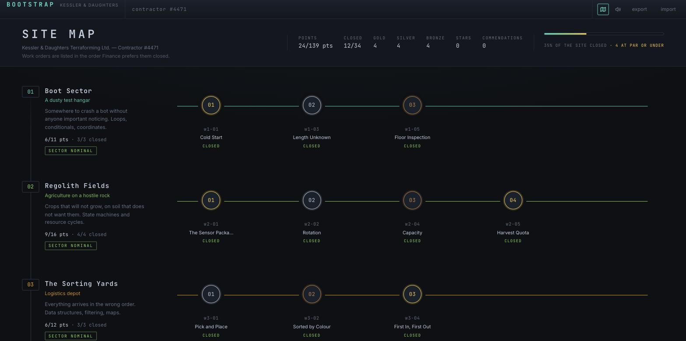

Seeded 12 work orders closed in a gold / silver / bronze cycle. World 1's three nodes are gold,
silver, bronze. On screen the only difference between them is the border colour of a 44px disc:
`#ffd166`, `#c0cbd8`, `#cd8b52`. Every one of them carries the same word underneath — **`CLOSED`,
in the same green, at the same weight** — and there is no legend anywhere on the screen.

Three compounding problems:

1. **Colour is the sole channel.** Gold and bronze are both warm yellow-orange separated mostly by
   lightness; on a deuteranopic or protanopic display they are the same ring. The player cannot
   read their own record.
2. **The medal ring collides with the world identity ring.** `.node--live .node__disc` sets
   `border-color: var(--world-accent)`, and the rail through the node is also `--world-accent`.
   So one 44px circle is being asked to carry *two* independent colour codings at once, and in
   World 3 (accent `#ffb020`, amber) the world colour and the gold medal colour are the same
   colour. World 8's accent **is** `--gold` (`#ffd166`) — every node in the finale looks gold.
3. **The component that fixes this already exists and is used on exactly one screen.**
   `src/ui/components/MedalBadge.tsx` renders `I` / `II` / `III` / `—` with `role="img"` and an
   `aria-label`. `grep` shows one caller: `src/ui/screens/Results.tsx:245`. The site map — the one
   screen whose entire job is *showing you your record across 34 work orders* — does not use it.

**The change.** Replace the `CLOSED` status word on a closed node with the medal badge plus the
grade, or put a `MedalBadge size="sm"` in the `.node__pips` row. This is a redundant-encoding fix,
not a decoration: text first, colour second.

Markup already exists for the slot — `node__pips` is rendered unconditionally and is empty on a
starless level:

```diff
--- a/src/ui/screens/LevelSelect.tsx
@@ node__pips block
                         <span className="node__pips" aria-hidden="true">
+                          {node.progress.completed ? (
+                            <MedalBadge medal={node.progress.medal} />
+                          ) : null}
                           {Array.from(
```

**Related, same screen:** the eight per-world accents in `src/levels/index.ts` are commented
*"Accents are drawn from the tokens.css palette family."* Three of them are not in `tokens.css` at
all (`#9a7bd8`, `#4ea8ff`, `#ff7ad9`) and two of them **are** reserved semantic tokens used for
non-semantic decoration: World 7 is `#ff5d5d` = `--danger`, World 8 is `#ffd166` = `--gold`. A
palette where the failure colour is also the name of a world is a palette that has stopped meaning
anything. See F-COLOUR below.

### F2 — Half of every three-node world's rail is empty, and titles are truncated beside it. **Confirmed.**

**Screen:** Site map. Same shot as F1.

`.world__nodes` is `grid-template-columns: repeat(5, minmax(0, 1fr))` — **hard-coded to five**,
regardless of how many work orders the world actually has. `.world__rail` is drawn
`left: 40px; right: 40px`, edge to edge. Measured at 1680×836 (rail is 1152px wide):

| world | nodes | dead rail to the right of the last node |
|---|---|---|
| 1 Boot Sector | 3 | **576px — exactly half the rail** |
| 2 Regolith Fields | 4 | 330px |
| 3 The Sorting Yards | 3 | **576px** |
| 4 Cave Systems | 4 | 330px |
| 5–8 | 5 | 83px (correct: half a slot) |

The rail is the strongest horizontal line on the screen and on four of the eight worlds it runs
600px past the last thing on it, into nothing. It reads as *"there are two more work orders here
and they failed to render"*, which is the opposite of what it means.

Simultaneously, in a **246px-wide** node slot, `.node__title` carries `max-width: 15ch` (≈109px) with
`text-overflow: ellipsis`. `The Sensor Package` renders as `The Sensor Packa…` **with 576px of
blank rail immediately to its right.** 12 of 34 campaign titles are longer than 15 characters.

**The change**, three lines, verified against the measured geometry — keep the slot pitch identical
across worlds (so the vertical rhythm of the map holds) and let the *track* be short:

```diff
--- a/src/ui/styles/screens.css
@@ .world__track
 .world__track {
   position: relative;
   min-width: 0;
+  max-width: calc(var(--node-count, 5) / 5 * 100%);
   padding: var(--space-3) 0;
 }
@@ .world__nodes
 .world__nodes {
   display: grid;
   position: relative;
-  grid-template-columns: repeat(5, minmax(0, 1fr));
+  grid-template-columns: repeat(var(--node-count, 5), minmax(0, 1fr));
   margin: 0;
   padding: 0;
   list-style: none;
 }
@@ .node__title
 .node__title {
   min-height: 15px;
-  max-width: 15ch;
+  max-width: 100%;
   overflow: hidden;
```

```diff
--- a/src/ui/screens/LevelSelect.tsx
@@ const style: StyleVars = {
             const style: StyleVars = {
               '--world-accent': row.world.accent,
               '--rail-fill': `${fill}%`,
+              '--node-count': String(row.nodes.length),
             };
```

`--node-count` is unitless, so `calc(var(--node-count) / 5 * 100%)` is legal and `repeat()` accepts
an integer custom property. Each world's slot pitch stays 246px; the rail stops one half-slot past
the last node on every world; the title gets the whole 246px it was already occupying.

### F3 — The site view is empty until you press Run. This is the worst thing on the screen. **Confirmed.**

**Screen:** Workspace, first entry to any work order.

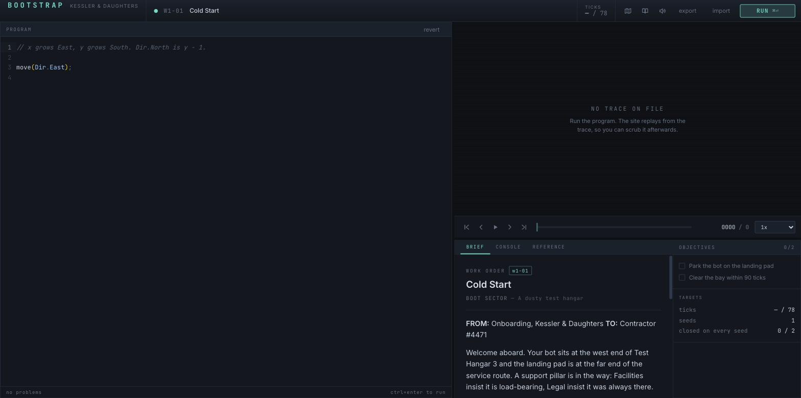

`w1-01`, standing start, 1680×836. Measured: Monaco **945×734**, site view **727×407**. The site
view contains the words `NO TRACE ON FILE / Run the program. The site replays from the trace, so
you can scrub it afterwards.` and nothing else. **The player has not seen the map.**

The brief tells them, in prose, that the bot "sits at the west end of Test Hangar 3", that "the
landing pad is at the far end of the service route", and that "a support pillar is in the way".
The *Site data* table adds `THE PILLAR — Two tiles East. The gap above it is the only way round.`
All of that is a verbal description of a 25×14 grid that the game is perfectly capable of drawing
and has chosen not to.

This is the single biggest gap against the genre bar. **Opus Magnum, TIS-100, Baba Is You and
Factorio all open on the board.** In Opus Magnum the reagents and the product are on the bench
before you place a single arm. In TIS-100 the input and output streams are populated before you
type. The board *is* the problem statement; the text is a gloss on it. BOOTSTRAP inverts that: the
text is the problem statement and the board is a reward for compiling.

Three consequences that the playtests would not have caught, because both playtesters could read:

1. **The brief cannot be cut further** while it is the only description of the level. Every word
   `docs/FIX-PROSE.md` removed had to be replaced by a *Site data* row, because the picture is not
   there to carry the load. The prose pass hit 58 words and then had to add a facts table — that is
   the tell.
2. **You cannot look at the level to decide what to write.** The genre's core loop is
   *look → hypothesise → write → watch*. Here it is *read → guess → write → watch*.
3. **The largest, most expensive-looking region of the screen is dead on arrival**, which is
   exactly what a new player's first screenshot of the game looks like.

**The change.** Render the level's initial world (`level.build(level.seeds[0])`) into the viewport
as soon as the work order opens, before any run. `Workspace.tsx` **already computes this object**
for the layout hook — `docs/FIX-VIEWPORT.md` §6 records it calling `level.build(seeds[0])` "when
there is no trace yet" purely to get the grid aspect. The world is in hand; it is being measured
and thrown away. Draw it, with the bot on its start tile and the transport at tick 0.

This is not a CSS diff and I am not going to pretend it is. It is the one structural change in this
report and it is worth more than everything else in it put together.

---

### F4 — Two thirds of the brief is below the fold, including the hint button, with no scroll cue. **Confirmed.**

**Screen:** Workspace, brief tab.

Measured on `w1-01` at 1680×836: `.doc-pane.brief` has `clientHeight: 300`, `scrollHeight: 949`.
**649px — 68% — is out of sight**, and macOS overlay scrollbars mean there is no scrollbar at rest.
Nothing about the panel says it continues.

What is hidden, in order:

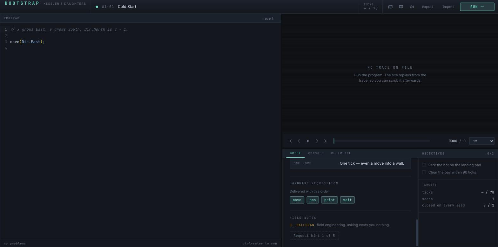

- `[EVALUATION LICENCE — 8 SEATS REMAINING]`
- **`SITE DATA`** — the four-row facts table that `docs/FIX-PROSE.md` added as *the* structured
  home for the level's numbers. `THE PILLAR`, `ROUTE AFTER IT` (`19 East, 5 South, 22 West, 5
  South, 22 East` — literally the solution), `DIRECTIONS`, `ONE MOVE`. The most load-bearing block
  in the brief is the one the player has to go looking for.
- `HARDWARE REQUISITION — Delivered with this order` with `move` `pos` `print` `wait` chips —
  a verbatim repeat of the modal that fired thirty seconds ago.
- `FIELD NOTES`, and then **`Request hint 1 of 5`**.

The hint system is the game's whole answer to "the player is stuck". It is the last element of a
949px document displayed 300px at a time. **Assume nobody reads: the hint button is hidden.**

Three separate changes, in order of value:

1. **Move `Request hint N of 5` out of the scroll flow.** It belongs pinned to the bottom edge of
   the brief pane, or in the objective rail next to the objective it is about. A control this
   important cannot live at document-bottom.
2. **Delete the `HARDWARE REQUISITION` block from the brief on the run where the requisition modal
   fired.** It is the same four chips, shown twice, ninety seconds apart. (Keep it for later
   visits — that is when it is useful.)
3. **Give the pane a bottom fade** so it is visibly cut off. One rule, no JS:

```diff
--- a/src/ui/styles/app.css
@@ .doc-pane
+.doc-pane {
+  mask-image: linear-gradient(to bottom, #000 calc(100% - 24px), transparent 100%);
+}
+.doc-pane:not([data-scrolled-end]) { /* if you want it to disappear at the end */ }
```

The one-rule version (always-on fade) is honest enough and costs nothing; the `data-` variant needs
a scroll listener and is not worth it.

### F5 — The divergence reads well, and then it is thrown away. **Confirmed.**

**Screen:** Run report (failure), then the workspace behind it.

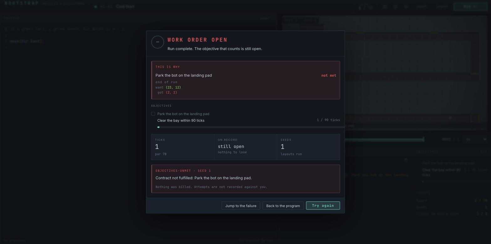

The presentation itself is **good**, and this is the report's best block:

```
THIS IS WHY
Park the bot on the landing pad                       not met
end of run
want (23, 12)
 got (2, 2)
```

Monospace, values aligned on the paren, `where` set dim above the pair, the whole thing in a
red-bordered card at the top of the modal. That is the right shape and it should not be touched.

Two things are wrong around it.

**(a) The modal is the only place the divergence exists.** Dismiss it and there is nothing. I
clicked *Jump to the failure* — the button whose name promises exactly this — and got the
workspace at tick 1 with **nothing marked on the map, nothing in the rail, and the console showing
the pre-divergence sentence** `Contract not fulfilled: Park the bot on the landing pad.`

`grep` for `divergence` across `src/ui`: it appears in `Results.tsx` and nowhere else.
`ObjectiveRail.tsx` renders `mark + label + progress` and has no divergence field at all. So the
game computed 98 divergences, prints one, and then reverts to the pre-divergence copy the moment
the player closes the box in order to go and fix the thing.

Two places it belongs, in order:

1. **On the grid.** `want (23, 12)` and `got (2, 2)` are two tiles on a map the renderer is
   already drawing, with a goal-bracket routine (`src/render/overlays.ts drawBrackets`) already
   written and already used for goals in amber. Mark `want` and `got` and connect them. This is
   the show-don't-tell case in its purest form: two coordinates the player must currently locate
   by counting squares on a grid that has no axis labels (see F6).
2. **In the objective rail**, as a third line under the failing row, in the same three-line form
   the report uses. The rail is the surface that survives the modal.

**(b) The same failure is stated four times in a 633px box.** Count them in the shot:

| where | text |
|---|---|
| header | `Run complete. The objective that counts is still open.` |
| `THIS IS WHY` | `Park the bot on the landing pad — not met` + divergence |
| `OBJECTIVES` | `☐ Park the bot on the landing pad` |
| `OBJECTIVES-UNMET · SEED 1` | `Contract not fulfilled: Park the bot on the landing pad.` |

The fourth is a strict subset of the second and adds nothing but a red box. **Cut the
`OBJECTIVES-UNMET` section on a single-seed failure** and keep its footnote (`Nothing was billed.
Attempts are not recorded against you.`) as a plain line. On a multi-seed level where different
seeds fail differently it earns its place; on one seed it is the same sentence twice, one card
apart.

Also cut, same modal: the `ON RECORD / still open / nothing to lose` tile. It occupies a third of
the stats row and holds no number, next to two tiles that do (`TICKS 1 / par 78`, `SEEDS 1`).

*(Failure-message wording is being changed by the mute-verbs agent; the structural counts above
are what I am reporting, not the sentences.)*

---

### F6 — You cannot count tiles on the grid, and the game is about counting tiles. **Confirmed.**

**Screen:** Site view, every level.

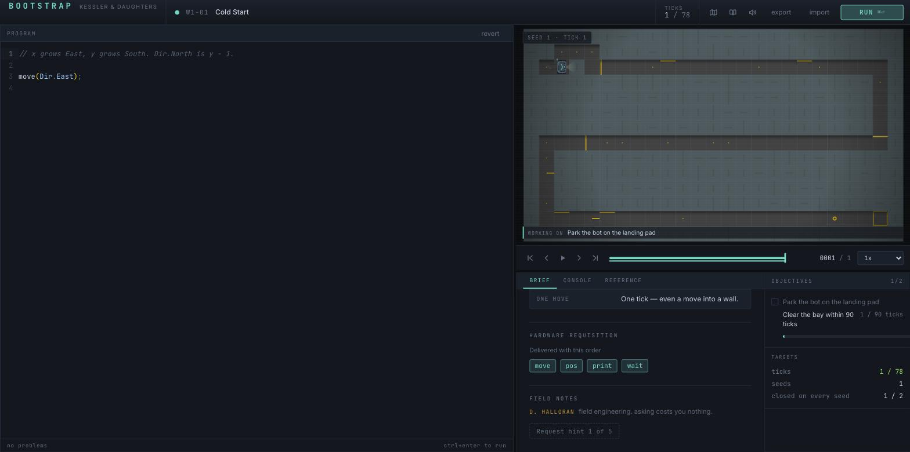

`src/render/theme.ts`:

```js
export const overlay = {
  grid: 'rgba(106, 122, 140, 0.18)',
  gridMajor: 'rgba(106, 122, 140, 0.30)',
```

18% and 30% of a mid-slate over a mid-grey floor sprite. Zoomed 5× into `w1-01` at 28px/tile, the
vertical lines are faintly present and the horizontal lines are **not visible at all**. The
every-fifth-line major rhythm that `drawGrid(…, major = 5, …)` deliberately builds — the exact
affordance that would let a player count `19 East, 5 South, 22 West` off the screen — cannot be
perceived.

This is not cosmetic. The brief's *Site data* table says `ROUTE AFTER IT: 19 East, 5 South, 22
West, 5 South, 22 East`; the failure report says `want (23, 12)`. Both require the player to count
cells. There are no axis labels, no ruler, and no coordinate readout on the canvas — the hover
brackets (`overlay.hover`) mark a cell but do not name it. **The player is given coordinates and
no coordinate system.**

Compare the bar: TIS-100's grid is a hard lattice of separated nodes; Opus Magnum's hex board has
a visible, countable lattice with a distinct off-board; Factorio's map has a chunk grid at a
different weight from the tile grid. In all three you can point at a cell and say which one it is.

Three changes, cheapest first:

```diff
--- a/src/render/theme.ts
 export const overlay = {
-  grid: 'rgba(106, 122, 140, 0.18)',
-  gridMajor: 'rgba(106, 122, 140, 0.30)',
+  grid: 'rgba(150, 170, 195, 0.22)',
+  gridMajor: 'rgba(53, 224, 200, 0.34)',
```

Making the *major* line the accent hue rather than a stronger grey is what turns "faint stripes"
into "a ruler": the eye separates the two families by colour, not by 12 points of alpha it cannot
resolve. (`src/render/**` HMR does not reach a hidden tab — hard-reload after changing this.)

Then, and worth more: **a coordinate readout on tile hover**, printed in the existing
`SEED 1 · TICK 1` chip. `overlays.ts` already computes the hovered `cell.x, cell.y` to draw the
brackets; it is throwing the numbers away.

And a wall/floor separation pass. `src/render/terrain.ts:144` currently tints walls with
`alpha(palette.bgVoid, 0.42)` because — its own comment — several source wall sprites are *lighter*
than their floor. A 42% black wash over an already-desaturated tile gives the ~1.3:1 wall/floor
contrast in the shot. A rim light on the wall's top edge would separate them at a tenth of the
cost of new art.

### F7 — `skip the ceremony` is a permanent settings change wearing a footnote's clothes. **Confirmed.**

**Screen:** Run report (pass), bottom-left.

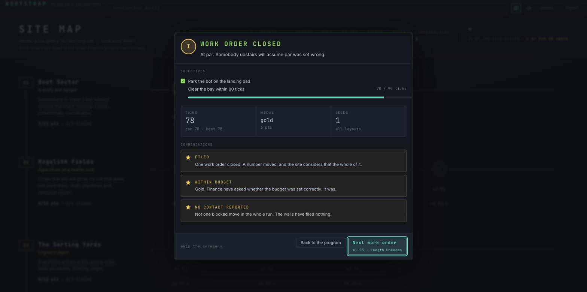

`src/ui/screens/Results.tsx:512` —

```jsx
<button className="modal__quiet" onClick={…setCelebrations(false)}
        title="Show future reports all at once">
  skip the ceremony
</button>
```

It is rendered as `modal__quiet`: 11px, dim, dotted underline, bottom-left corner, furthest point
on the modal from where the eye is. Every other button on the screen is a bordered `.btn`.

Two defects in one control:

- **It reads as "skip *this* animation" and it is not.** It writes
  `save.settings.celebrations = false` for the rest of the campaign. A player who is impatient
  once has silently turned off the staged reveal for all 34 work orders. The only warning is a
  `title` tooltip nobody will hover.
- **It is the only way to reach the setting, in either direction.** The one settings screen in the
  game is `AudioSettings`, `aria-label="Sound settings"`, and it holds volumes and audio toggles
  only. Once `celebrations` is off, the label becomes `ceremony off` — which reads as a *status
  line*, not as the button that turns it back on. A player who hit it by accident on `w1-01` has
  no route back that they would recognise as one.

**The change**, and it is only copy plus one class:

```diff
--- a/src/ui/screens/Results.tsx
-              className="modal__quiet"
+              className="btn btn--ghost"
               onClick={(event) => {
                 event.stopPropagation();
                 setCelebrations(false);
               }}
-              title="Show future reports all at once"
             >
-              skip the ceremony
+              Show reports all at once
@@
-              className="modal__quiet"
+              className="btn btn--ghost"
               onClick={(event) => {
                 event.stopPropagation();
                 setCelebrations(true);
               }}
-              title="Let future reports arrive one line at a time"
             >
-              ceremony off
+              Show reports one line at a time
```

Both labels then name the *state they move to*, which is the only rule that makes a two-way toggle
readable without a tooltip. Better still, put the pair in the settings modal and rename that modal
from `Sound settings` to `Settings` — but that is a bigger move and I am only proving the small one.

---

### F8 — The report gives the participation awards more room than the result. **Confirmed.**

**Screen:** Run report (pass). Same shot as F7. Measured: modal 680×648.

| block | height | what it says |
|---|---|---|
| verdict + flavour | 90px | `WORK ORDER CLOSED` |
| `objectives` | 87px | two rows |
| stats row | 66px | `TICKS 78 / par 78 · best 78` · `MEDAL gold / 3 pts` · `SEEDS 1 / all layouts` |
| **`commendations`** | **228px** | three cards |
| footer | 60px | |

**35% of the modal is three commendations, all three of which fired on the player's first ever
work order**: `FILED — One work order closed`, `WITHIN BUDGET — Gold`, `NO CONTACT REPORTED — Not
one blocked move in the whole run`. The medal — the thing the whole screen exists to deliver — is
the word `gold` in 20px lowercase mono inside a stats tile, styled identically to `78` and `1`
either side of it, plus a 40px `I` disc in the corner.

That is a hierarchy inversion. The result is a caption; the participation trophies are the
composition.

Two things to change, and one to think about:

1. **Give the medal the stats row to itself**, or at least make it the largest thing below the
   header. `MEDAL / gold / 3 pts` currently competes on level terms with `SEEDS 1 / all layouts`,
   which on a one-seed level is a tile that says nothing at all — **cut the seeds tile when
   `level.seeds.length === 1`**.
2. **Cap the commendations at two per report and roll the rest into a `+2 more` line** that opens
   the shelf. Three cards, each with a caps title *and* a sentence, is a paragraph in a place the
   eye wants a badge.
3. **The report never compares you to anything but par.** `par 78 · best 78` is the whole of it.
   The genre's answer to "how did I do" is a distribution: Opus Magnum and TIS-100 both close a
   puzzle with three histograms showing where your solution sits. BOOTSTRAP has 34 levels, the
   ticks, the instruction count and the seeds to build the same thing against the player's *own*
   history and against par, and shows a word instead. This is the second-biggest missed
   opportunity in the game after F3, and it is the reason the report feels like a receipt rather
   than a score.

### F9 — The run report's last paragraph is drawn underneath its own footer. **Confirmed. This is a bug.**

**Screen:** Run report on any multi-seed level. Reproduced on `w4-05` (5 seeds), 1680×836, empty
program.

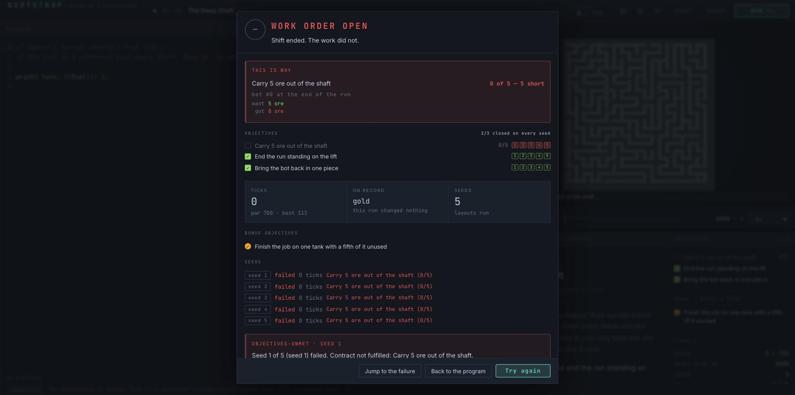

Measured in the browser, CSS pixels:

```
.modal__body   top 113   bottom 820   clientHeight 707   scrollHeight 707   overflow-y: visible
.modal__foot   top 758   bottom 811
.failure-box   top 707   bottom 804
```

`.modal__body` is `overflow: visible` and its content is **113px taller than the box it is in**.
The `objectives-unmet · seed 1` card runs from 707 to 804; the footer bar sits on 758–811 and is
painted over it. The sentence `Nothing was billed. Attempts are not recorded against you.` — which
exists specifically to stop a new player thinking a failed run costs them something — is rendered
*behind an opaque bar*. `scrollHeight === clientHeight`, so nothing scrolls: there is no route to
the hidden text at all.

This is the largest window I can drive. It gets worse on anything shorter; at a 13" 1280×800 the
seed list goes under too (see F12).

**The change** — make the body the scroller and let the footer keep its own row:

```diff
--- a/src/ui/styles/app.css
@@ .modal__body
 .modal__body {
+  min-height: 0;
+  overflow-y: auto;
 }
```

`.modal` is already a flex column with a `flex: none` footer, so a `min-height: 0` on the body is
all that is needed for it to shrink and scroll instead of overflowing. Pair it with the F4 bottom
fade so the cut is visible.

---

### F10 — When five seeds fail identically, the report prints the same sentence five times. **Confirmed.**

**Screen:** Run report, `SEEDS` block. Same shot as F9.

```
seed 1   failed  0 ticks  Carry 5 ore out of the shaft (0/5)
seed 2   failed  0 ticks  Carry 5 ore out of the shaft (0/5)
seed 3   failed  0 ticks  Carry 5 ore out of the shaft (0/5)
seed 4   failed  0 ticks  Carry 5 ore out of the shaft (0/5)
seed 5   failed  0 ticks  Carry 5 ore out of the shaft (0/5)
```

Five rows, character-for-character identical, 115px of the modal — and this is the *common* case,
because the usual reason a program fails on seed 1 is the reason it fails on all of them. The
per-seed list earns its space only when the seeds **disagree**, which is exactly the case it is
there to reveal.

Worse, the information is already on screen twice over and better: the objective rows carry
per-seed chips `1 2 3 4 5` in red/green (a genuinely good, dense display — keep it), and
`THIS IS WHY` already names the objective and the shortfall.

**The change.** Collapse the `SEEDS` block when every seed produced the same `(failed, objective,
progress)` triple, to one row:

> `all 5 seeds   failed  0 ticks  Carry 5 ore out of the shaft (0/5)`

and print the full list only when they differ. Two related cuts in the same modal:

- `objectives-unmet · seed 1` reads `Seed 1 of 5 (seed 1) failed.` — the seed number appears
  three times in nine words.
- On a **one-seed** level, cut the `SEEDS` block and the `SEEDS 1 / all layouts` stat tile
  entirely (see F8).

### F11 — `--ink-dim` fails AA everywhere, and a ghost button is indistinguishable from a disabled one. **Confirmed, computed.**

**Screens:** all of them. Photographed on the Repository ceremony.

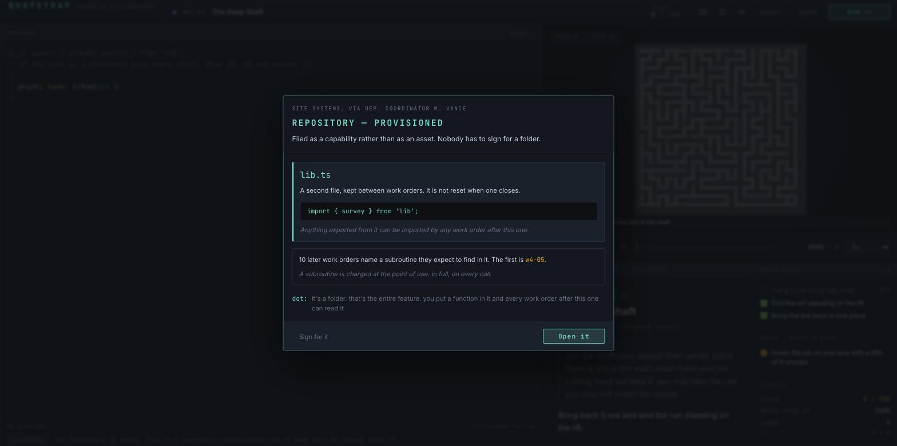

Look at the footer of that modal. `Sign for it` on the left is **a real, enabled button** — the
accessibility tree confirms `button "Sign for it" [ref_343] type="button"`. Computed style:

```
.btn--ghost   border-color: transparent   background: transparent   color: #6a7a8c   font-size: 12px
```

And three rules above it in the same file:

```css
.btn:disabled { color: var(--ink-dim); opacity: 0.5; cursor: not-allowed; }
```

**An enabled ghost button is the disabled colour at full opacity.** That is the entire visual
difference between "you can press this" and "you cannot". `.btn--ghost` is not a rare treatment —
it is the class on **export**, **import**, the editor's **revert**, and this modal's **Sign for
it**: four controls, none of which look like controls.

The contrast numbers, computed (WCAG 2.1 relative luminance, AA normal text needs 4.5:1):

| foreground | background | ratio | verdict |
|---|---|---|---|
| `--ink-dim #6a7a8c` | `--bg-raised #1b2430` | **3.56 : 1** | fail |
| `--ink-dim #6a7a8c` | `--bg-panel #121820` | **4.18 : 1** | fail |
| `--ink-dim #6a7a8c` | `--bg-void #0a0e14` | **4.41 : 1** | fail |
| `--ink #c9d5e3` | `--bg-panel #121820` | 12.9 : 1 | pass |

`--ink-dim` fails AA **on all three surfaces**, and it is used 111 times across `src/ui` and
`src/meta` — it is the token for every caption, every panel label, every `rail__label`, every stat
sub-line, the `dot:` asides, the console's system lines. This is not a corner case; it is a
substantial fraction of the words in the game, set below the readable threshold on the surface
they most often sit on.

The palette wants one more step. `#8296ab` clears 4.5:1 on `--bg-raised` (5.02:1) and still reads
as clearly secondary against `--ink`:

```diff
--- a/src/ui/styles/tokens.css
   --ink: #c9d5e3;
-  --ink-dim: #6a7a8c;
+  --ink-dim: #8296ab;
+  --ink-faint: #6a7a8c;
```

Then move the genuinely decorative uses (the scanline-era `dot:` speaker prefix, the `world__num`
plate) to `--ink-faint` deliberately, rather than having everything land on a failing value by
default. And give `.btn--ghost` a visible resting border:

```diff
--- a/src/ui/styles/app.css
 .btn--ghost {
-  border-color: transparent;
+  border-color: var(--border);
   background: transparent;
-  color: var(--ink-dim);
+  color: var(--ink);
 }
```

**Credit where it is due:** the Repository ceremony itself is one of the two best screens in the
game. `lib.ts`, one sentence, a real code line the player can copy (`import { survey } from
'lib';`), and then the line that does the actual work — *`10 later work orders name a subroutine
they expect to find in it. The first is w4-05.`* That is a **number, a scope and a next action** in
fourteen words, and it is exactly what the OPEN-ITEMS entry meant by "show, don't tell". The other
ceremonies should be measured against this one.

### F12 — Opening the Repository hides the player's program, and the only way back is 10px tall. **Confirmed.**

**Screen:** Repository panel.

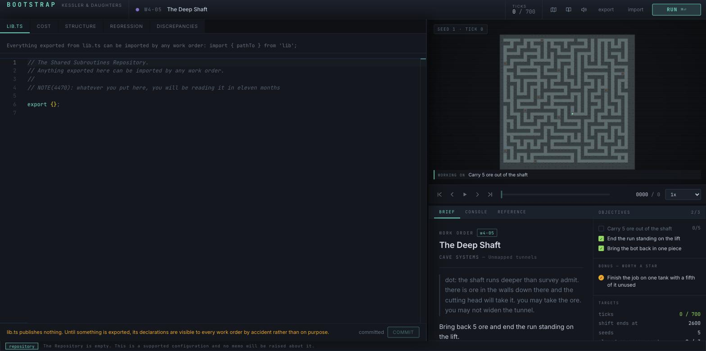

I clicked `Open it` on the Repository ceremony. The entire left column — the program editor —
was replaced by a five-tab panel: `LIB.TS · COST · STRUCTURE · REGRESSION · DISCREPANCIES`. **My
program was gone and no tab on that panel goes back to it.**

The control that closes it, read off the accessibility tree:

```
button "Shared Subroutines Repository"   class="statusbar__toggle"   aria-pressed="true"
text "repository"   font-size 10px   rect 78 × 16 px   at (13, 816)
```

**Ten pixels, seventy-eight wide, bottom-left corner of an 836px window.** It is the smallest type
in the application and it is the only door in or out of the game's largest meta-feature. The
`aria-pressed` is correct and the accessible name is good — the *visual* affordance is the problem,
not the semantics.

Two other things fall out of the same screenshot:

- **Two `textbox "Editor content"`.** The program's Monaco (`ref_329`) stays in the tree while
  `lib.ts`'s (`ref_350`) is on top. A keyboard user tabs into two identically-named editors and
  cannot tell which is which. Name them `Program` and `lib.ts`.
- **Four of the five tabs are an empty sentence in the corner of a 930×680 void.** `COST` renders
  `The Repository is empty. This is a supported configuration and no memo will be raised about
  it.` — **the same sentence, word for word, that is already printed in the status bar 650px
  below it on the same screen**. `REGRESSION` renders one line. An empty state should say what the
  tab *will* show once it has something; these say only that it has nothing.

**The change.** Make `program` a sixth tab in the same tab strip, or a peer of it — the Repository
already owns the whole column, so the program deserves to be in the same control, not behind a
status-bar chip. And delete the duplicate empty-state sentence from the tab body; keep the status
bar's copy.

---

### F13 — The Repository greets you with 37 words, in red, telling you off for a state it just put you in. **Confirmed.**

**Screen:** Repository panel, the two status bars. Same shot as F12; zoomed:

```
lib.ts publishes nothing. Until something is exported, its declarations are visible to
every work order by accident rather than on purpose.            committed  [COMMIT]
[repository]  The Repository is empty. This is a supported configuration and no memo will
              be raised about it.
```

The first line is **red** (`--danger`). It is 21 words of disapproval about a folder the player was
handed four seconds ago and has not touched. The second line, directly underneath, says the state
is *fine*. The two lines contradict each other in tone, at a combined 37 words, to convey "the
folder is empty".

The standing directive is cut text, show don't tell, de-noise in doubt. This is the clearest
violation of it in the game.

**The change.** One line, not red, and only when it is *actionable* — i.e. when there is something
in `lib.ts` that could be exported and is not:

> `lib.ts is empty. Publish a function from a work order, or write one here and export it.`

Suppress it entirely on the visit where the ceremony has just handed the player the folder.

---

### F14 — The commendation shelf is at the bottom of an eight-screen scroll and nothing points at it. **Confirmed.**

**Screen:** Site map, foot of the page.

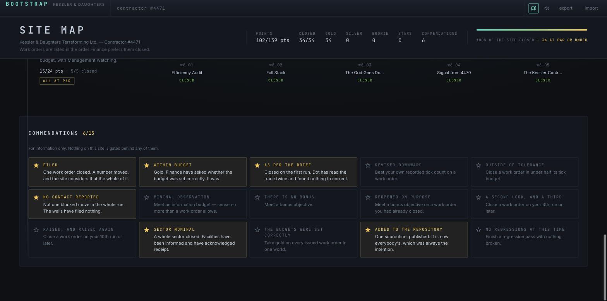

`COMMENDATIONS 6/15`, a 5 × 3 card grid, below all eight worlds. Getting there means scrolling
past ~2,900px of site map. There is **no link to it, no tab, no anchor, and no keyboard shortcut.**
The header stat strip does print `COMMENDATIONS 6` — and that number is not a link. A player who
never scrolls to the bottom of the site map never learns this screen exists.

The shelf itself is **well made** and I want that on the record: an earned card fills its star,
lifts its title to `--ink`, and — the good bit — **swaps the copy from the criterion to what you
actually did**. `Beat your own recorded tick count on a work order` becomes `One work order closed.
A number moved, and the site considers that the whole of it.` That is a real piece of craft.

Two changes:

1. **Make the header stat a link.** `COMMENDATIONS 6` in `.screen-stat` should scroll the shelf
   into view. One `<a href="#commendations">`, no new chrome, and it solves the whole finding.
2. **Print the date.** `save.achievements` stores the epoch ms each commendation was earned and
   the shelf shows none of it. Adding `earned 3 Sept` under an earned card costs one line and turns
   a checklist into a record — this is a "silent where it should show a number" case.

### F15 — Across three window sizes, the brief is the panel that always loses. **Confirmed, measured.**

**Screen:** Workspace, `w4-05` (40×40, the worst-case level). Sizes simulated per
`docs/FIX-VIEWPORT.md` §4; all figures divided back out of the `zoom` factor, so they are exact
CSS pixels.

| window | Monaco | site view | brief box | brief content | **hidden** | rail |
|---|---|---|---|---|---|---|
| 1280×800 (13") | 613×674 | 660×372 | 390×**275** | 1409 | **1134px — 81%** | 292/392, scrolls |
| 1680×836 (real) | 945×734 | 727×407 | ~430×300 | 949 (`w1-01`) | 649px — 68% | fits |
| 2560×1440 | **1572**×1312 | 979×979 | 708×**307** | 1108 | **801px — 72%** | 337/349, scrolls |

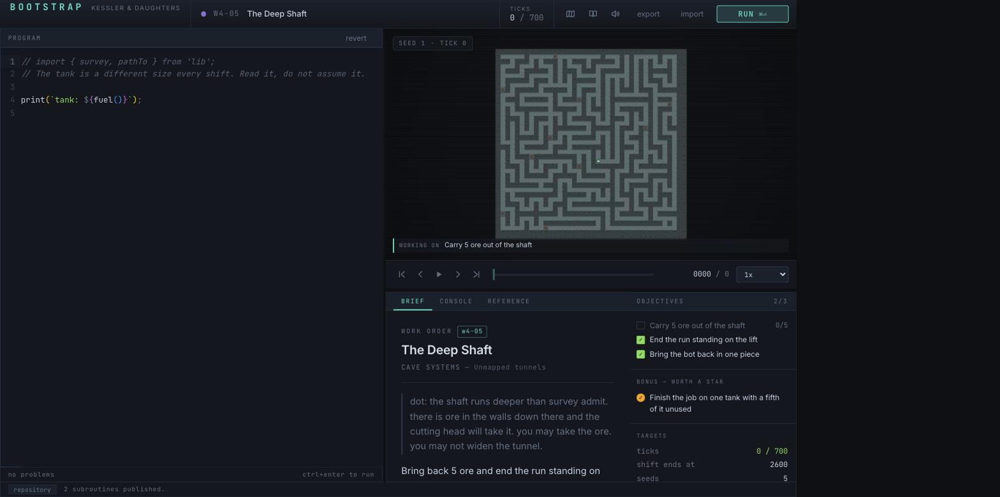
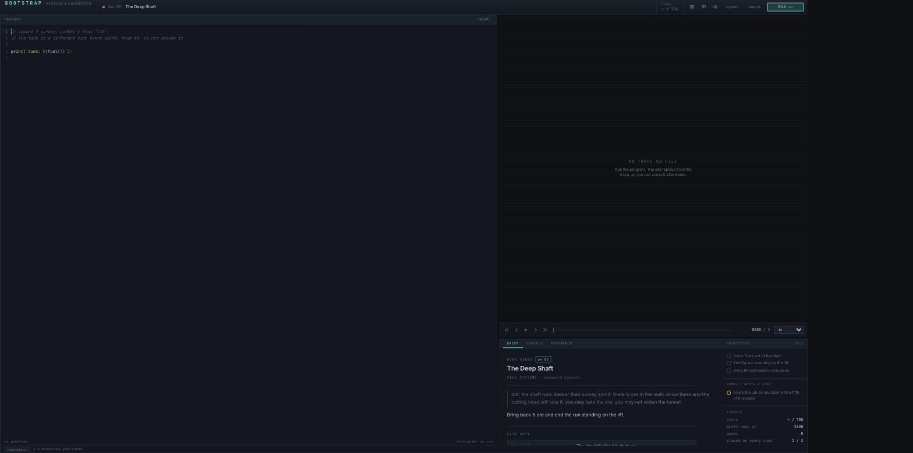

Three things fall out of that table, and one of them is the answer to the question
`docs/FIX-VIEWPORT.md` §7 deferred to this audit.

**(a) The 340px detail-panel cap was set against the wrong measurement.** The hook caps the
detail panel because "past that it only grows whitespace". It is not whitespace: at 2560×1440 the
brief pane is **307px tall holding 1108px of content**. Trebling the window height buys the brief
**nothing** — 300px at 1680, 307px at 2560 — while the editor column goes 945 → 1572. The surplus
went to the one panel that had no use for it, past the one panel that is starving. The cap should
be `min(340, contentHeight)` on a per-level basis, or simply raised when the grid has already
taken its ladder rung and cannot spend more height.

**(b) Yes, put a max-width on the code column.** Measured at 2560×1440: Monaco is 1572px wide,
its content area 1539px, and one character is 7.79px — **198 characters of measure**. No campaign
solution is close: `w1-01`'s reference is 11 lines with a longest line of 43 characters. The
typographic bound for a readable measure is 45–90 characters; 198 is more than double the top of
it, and the practical effect is that a 40-character line of code sits alone in the left fifth of a
1572px field.

```diff
--- a/src/ui/styles/app.css
@@ the editor panel's Monaco host
 .editor__host {
+  width: 100%;
+  max-width: 110ch;
 }
```

110ch at 7.79px ≈ 857px, which is above every line the campaign contains and below the point where
the eye loses the line. Left-align it rather than centring — the gutter and the line numbers are
the anchor. **Then give the reclaimed width to the site view**, which at 2560 is the panel that can
still spend it (`w8-05` at 48×40 is still only on the 24px rung).

**(c) On a 13" laptop, `w4-05` has no grid at all.** The site view is 660×372 for a 40×40 grid, so
`tilePx = 9.3`. `src/render/overlays.ts drawGrid` opens with `if (tile < 10 * dpr) return;`. At
9.3 CSS px on a 1× display the grid overlay **is not drawn** — not faint, absent. Combined with F6
this means the two largest levels in the game are, on the most common laptop size, a field of
undifferentiated grey rectangles.

Also confirmed at 1280×800: **the failure report clips 97px** and the whole `objectives-unmet`
card, including `Nothing was billed. Attempts are not recorded against you.`, is drawn behind the
footer with no scroll. See F9 — the dialog's own bottom edge lands at y=819 in an 800px window.

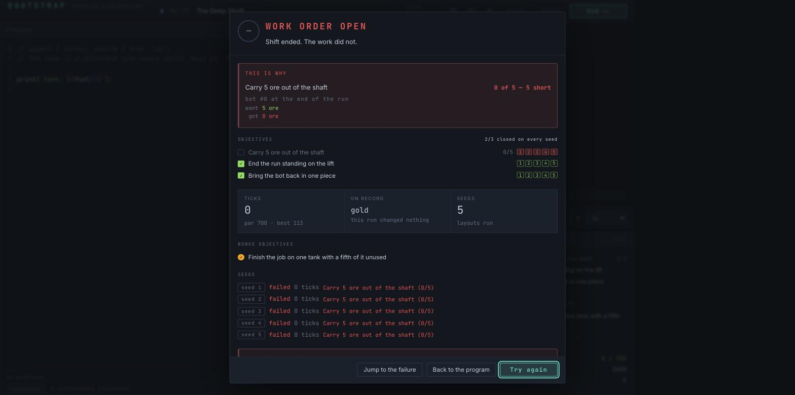

### F16 — The manual for a programming game is displayed in a 390 × 290px box. **Confirmed, measured.**

**Screen:** Reference / docs panel.

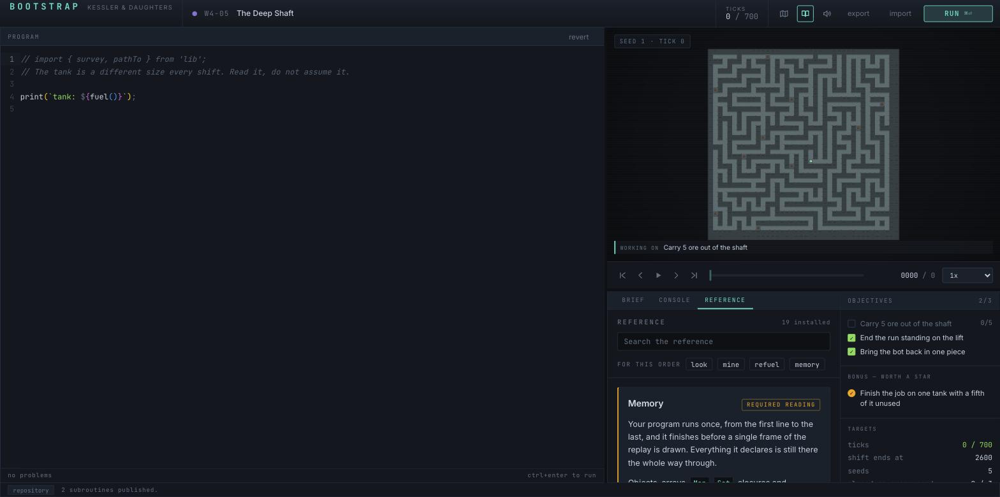

Measured at 1680×836, `w4-05`:

```
.doc-pane.docs   390 × 290 px       clientHeight 290   scrollHeight 11444
                 29 entries         12,733 characters
```

**Eleven and a half thousand pixels of documentation, shown 290 at a time.** That is a
thirty-nine-screen scroll through a window the size of a business card, in the bottom-right corner,
underneath a maze, beside an objective rail — while **945 pixels of empty Monaco** sit on the left
half of the same screen.

The panel itself is well built: a search box, a `FOR THIS ORDER` chip row (`look mine refuel
memory`) that scopes the manual to the level in hand, `19 installed` as a count, and a
`REQUIRED READING` badge on the entries that matter. `docs.css` is 13KB and `DocsPanel.tsx` is
17KB. Real work went into this and almost none of it is visible at once.

There is also **no way to make it bigger**. `grep` for `expand|maximize|fullscreen` in
`DocsPanel.tsx` returns nothing. The top-bar book icon (`aria-label="Reference"`,
`title="Reference (F1)"`) does not open an overlay — it calls `setPanel('docs')`, which switches
the *same* 390×290 tab. So the top bar and the tab strip are **two controls for one action**, and
the more prominent of the two implies a bigger surface that does not exist.

**The change.** Give the reference an expanded mode that takes the editor column, the way the
Repository already takes it — the mechanism exists and is used. A single button in the panel head:

> `⤢ expand` → docs render at `945 × 734` instead of `390 × 290`, one Escape to collapse.

Compare the bar. TIS-100 ships its reference as a **printed manual you can put beside the
keyboard**; Opus Magnum's is a full-screen overlay. Neither asks you to read 12,000 characters
through a slot.

---

### F17 — Eight keyboard shortcuts exist. Three are mentioned, in tooltips. **Confirmed.**

**Screen:** Workspace. This one is from the source and the accessibility tree, not a photograph.

`src/ui/hooks/useKeyboard.ts` binds:

| key | action | announced in the UI? |
|---|---|---|
| `Cmd/Ctrl + Enter` | run | **yes** — on the RUN button, and `ctrl+enter to run` in the status bar |
| `Escape` | close modal / back to site map | tooltip on the Site map button only |
| **`Space`** | **play / pause the replay** | **nowhere** |
| `←` `,` | step back one tick | tooltip |
| `→` `.` | step forward one tick | tooltip |
| **`Shift + ←/→`** | **step ten ticks** | **nowhere** |
| `Home` / `End` | jump to start / end | tooltip |
| `?` / `F1` | open the reference | tooltip |

There is no shortcut list, no help overlay, and no "press ? for help" line anywhere on the screen.
Half the bindings are announced only by hovering a 24px icon and waiting for the OS tooltip;
`Space` and `Shift+arrow` — the two that make scrubbing a 700-tick trace bearable — are announced
nowhere at all.

Note also a **direct contradiction on screen**: the RUN button's glyph reads `⌘⏎` and the status
bar 700px below it reads `ctrl+enter to run`. On the same machine, at the same moment, the game
gives two different keys for its most important action.

**The change.** `?` already opens the reference. Add a `Keys` entry to the reference — it is a
docs entry, not new chrome — put `press ? for keys` in the status bar in place of the
`ctrl+enter to run` line, and make the status-bar hint use the platform modifier the RUN button
already knows how to render.

### F18 — Your grade is shown once, ever, and then it is unreachable. **Confirmed.**

**Screen:** Management memo, and the site map after it.

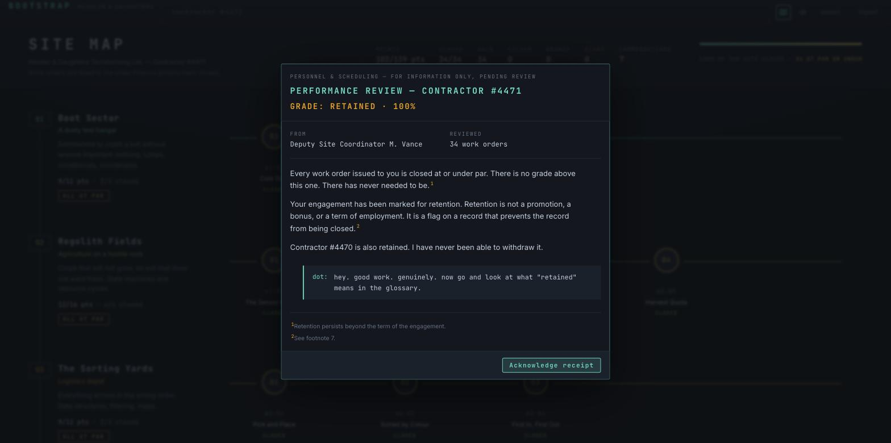

The memo is **the second-best screen in the game**. `GRADE: RETAINED · 100%` in gold, a two-column
`FROM / REVIEWED 34 work orders` fact row, three short paragraphs, and two footnotes of which the
second is `²See footnote 7.` — there is no footnote 7. That is the joke landing exactly, in about
ninety words, and it should not be touched.

Then you click **Acknowledge receipt** and it is gone forever.

I pulled the full page text of the site map immediately afterwards. The words `RETAINED`, `GRADE`
and `100%` do not appear anywhere on it. The top bar is `Site map · Reference · Sound settings ·
export · import`. There is no route back to the memo, no grade in the header strip, and
`save.reviewedRanks` exists precisely to make sure it never fires twice.

`docs/FIX-REVIEW-CUT.md` deleted the Performance Review screen and left the memo as the delivery
vehicle. That was the right call for the screen — but the *state* went with it. Since that cut,
**the game has no surface at all that tells a player how they are doing overall**, except for one
modal that self-destructs.

**The change.** Put the live grade in the site map's header stat strip, beside `POINTS`:

> `GRADE · RETAINED`

`reportFor(save)` already computes it on every render for the delivery check; it is one more
`.screen-stat`. Make it the link that re-opens the last memo, and F14's shelf link can use the
same pattern.

**While in that header — it contradicts itself.** In the same 1200px strip, at an all-gold,
no-stars record:

```
POINTS 102/139 pts    CLOSED 34/34    ▓▓▓▓▓▓▓▓▓▓▓▓ (bar full)
                                       100% OF THE SITE CLOSED · 34 AT PAR OR UNDER
```

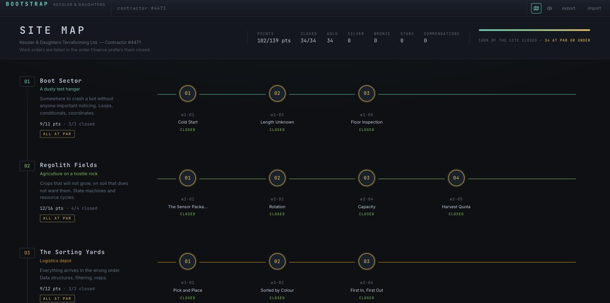

A flawless player reads **73%** and **100%** side by side. The 139 denominator is
`34 × 3 + 37 bonus stars`, so a perfect medal wall is permanently capped at 73% of "points".
`docs/FIX-REVIEW-CUT.md` §1 identified this exact disease on the review screen and fixed it there —
*"a perfect medal wall is 100%"* — and then left the identical fraction on the site map, which is
the screen the player actually looks at. Either split it (`MEDALS 102/102 · STARS 0/37`) or drop
the denominator, as the review's `REVIEWED` line already did.

---

### F19 — Settings is called `SOUND` and only does sound. **Confirmed.**

**Screen:** Sound settings.

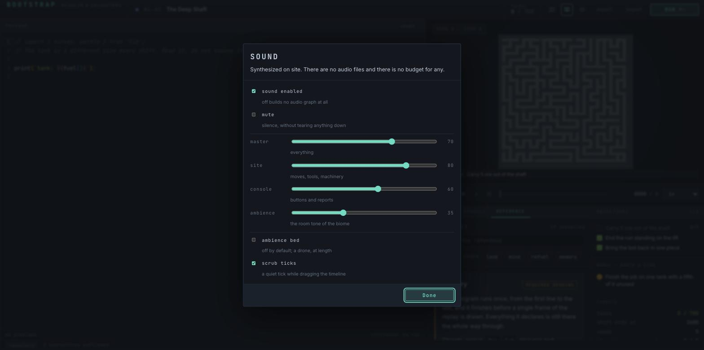

Taking the compliment first: **this is the best-composed dialog in the game.** Even 24px gaps,
label / one-line note pairs on a consistent baseline, four sliders on one left edge with their
values right-aligned in a tabular column, a clean rule between groups. `Synthesized on site. There
are no audio files and there is no budget for any.` is one sentence doing flavour and a technical
fact at once. Whoever laid this out should lay out the run report.

The problem is the scope. It is `aria-label="Sound settings"`, titled `SOUND`, and it is **the only
settings screen in the application**. Everything else the player can configure lives somewhere
else and is hard to find:

| setting | where it actually lives |
|---|---|
| `celebrations` (staged report reveal) | a dim link in the corner of the run report — see F7 |
| `consoleCap` | nowhere; it is in the save and has no UI |
| `layout` splitter fractions | drag-only, no reset |
| reduced motion | OS only, no mirror or indicator |
| export / import save | top bar, as `.btn--ghost` — see F11 |

**The change.** Rename the modal `SETTINGS`, keep `SOUND` as its first section header, and move
`celebrations` in as a second section. That is one heading and one moved control, and it turns four
scattered affordances into one place a player would think to look.

One content nit while it is open: `sound enabled` (*off builds no audio graph at all*) and `mute`
(*silence, without tearing anything down*) are two checkboxes for one player-visible outcome. The
distinction is an engineering one. Keep `mute`; make `sound enabled` implicit.

---

### F20 — Two unhandled promise rejections on every page load. **Confirmed. Suspected impact: none visible, but it is a real fault.**

**Screen:** any. From the console, not a photograph.

```
[EXCEPTION] Uncaught (in promise)
    at installTypes (http://localhost:5299/src/ui/library.ts:87:2)
[EXCEPTION] Uncaught (in promise)
    at installTypes (http://localhost:5299/src/ui/library.ts:87:2)
```

Fires twice on a clean reload of the site map, before any interaction. Nothing visibly breaks —
Monaco's `lib.ts` types are the likely casualty, so the effect would be missing autocomplete on
library imports rather than a crash. It is a `void`-ed or un-`catch`-ed promise in
`src/ui/library.ts` around line 87 and it should be handled either way: an unhandled rejection is a
thing that shows up in a browser's error console for every player who opens devtools, in a game
whose whole subject is careful programs.

### F21 — The publish offer crashes the whole application to a black screen. **Confirmed, reproduced twice, root cause read from the source.**

**Screen:** Publish dialog — or rather, the absence of one.

> This is a crash, not a visual defect, and I found it while trying to photograph the publish
> dialog. It is reported here because it is the most damaging thing in the build and because it
> means **there is no screenshot of the publish dialog in this audit — the dialog cannot be
> reached.**

**Repro**, from a clean `bootstrap.library` written to exactly the shape `emptyLibrary()`
produces, with `unlocked: true, briefed: true`:

1. Open `w1-01`.
2. Program contains a top-level function (`function leg(dir, n) { … }`) plus the solution.
3. `Cmd+Enter`. The work order closes at gold — report renders normally:

   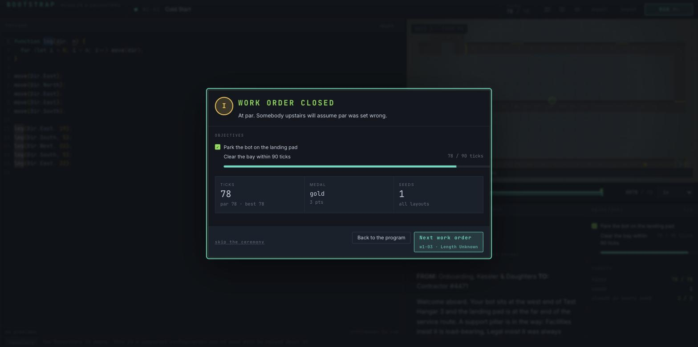

4. Click **Back to the program**, which is when `src/ui/library.ts` calls `offerPublish`.
5. **The entire application unmounts. 1568 × 780 of `--bg-void` and nothing else.**

   

`document.getElementById('root').children.length === 0`. Console:

```
An error occurred in the <PublishDialog> component. Consider adding an error boundary
to your tree to customize error handling behavior.
```

Reproduced twice — once with a hand-seeded library holding published functions, once with the
canonical empty one — so it is not a malformed-save artefact.

**Root cause.** `src/meta/ui/PublishDialog.tsx`:

```jsx
const selection = useMemo(
  () => closureOf(offer?.declarations ?? [], [...picked]).map(…),
  [offer, picked, names],            //  <-- depends on `offer`
);

useEffect(() => {
  setSelection(selection);           //  <-- writes `offer`
}, [selection, setSelection]);
```

and `src/meta/store.ts:352`:

```js
setSelection(selection) {
  const offer = get().offer;
  if (!offer) return;
  set({ offer: { ...offer, selection } });   //  <-- new object identity, every call
},
```

`selection` is memoised on `offer`. The effect calls `setSelection`, which replaces `offer` with a
**new object**. That invalidates the memo, which produces a new `selection` array, which re-fires
the effect, which replaces `offer` again. Unconditional infinite update loop on mount, independent
of what the player selected. React throws `Maximum update depth exceeded` and, with no boundary
above it, takes the tree with it.

**Two fixes, both needed.**

```diff
--- a/src/meta/store.ts
@@ setSelection
     setSelection(selection: PublishSelection[]): void {
       const offer = get().offer;
       if (!offer) return;
+      if (
+        offer.selection.length === selection.length &&
+        offer.selection.every((each, i) => {
+          const next = selection[i];
+          return next !== undefined && each.name === next.name && each.publishAs === next.publishAs;
+        })
+      ) {
+        return;
+      }
       set({ offer: { ...offer, selection } });
     },
```

An identity guard breaks the cycle at the store, which is where the new object is minted. The
component-side fix — memoising `selection` on `offer.declarations` and `offer.levelId` rather than
on the whole `offer` — is equally valid and I would apply both.

**And put a boundary above the modal layer.** `src/ui/components/PanelBoundary.tsx` already exists
and is used exactly once, on the Repository panel (`Workspace.tsx:53`). `<Results />`,
`<PublishDialog />`, `<RepositoryIssue />`, `<Requisition />` and `<ReviewMemo />` all render bare
in `App.tsx`. A throw in any of them blanks the game. Whatever else happens, a rendering fault in a
*modal* must not be able to delete the site map, the editor and the player's unsaved code from the
screen.

### F22 — Paused mid-trace is the best the game looks. Two numbers on it disagree. **Confirmed.**

**Screen:** Workspace, paused at tick 55 of 78 on `w1-01`.

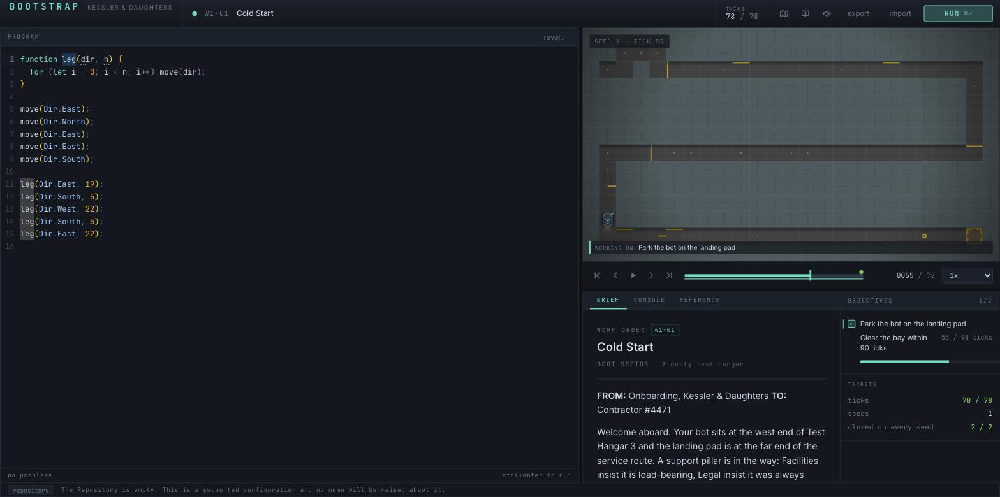

This state is the one that reads properly and it is worth saying why, because the fixes elsewhere
should copy it:

- The `SEED 1 · TICK 55` chip and the `WORKING ON  Park the bot on the landing pad` strip frame the
  canvas without covering it. The strip naming the *current* objective is the single best piece of
  information design in the build — it answers "what am I watching" without being read.
- The objective rail switches the active row to `▶` with `aria-current="step"`, and the row's
  progress goes live: `Clear the bay within 90 ticks   55 / 90 ticks` with a bar underneath.
- The scrubber fills teal behind the handle and carries a green dot at 78. The transport, the
  chip, the strip and the rail all update from one scrub, in one frame.

**The defect on it.** The top bar reads `TICKS 78 / 78` while the transport reads `0055 / 78` and
the rail reads `55 / 90 ticks`. Three tick counters, two different current values, within 700px.
The top-bar counter is showing the *result*, the transport the *playhead*. Both are called `TICKS`.
Make the top bar follow the playhead while a trace is being scrubbed, or rename it `RESULT`.

**Two smaller ones on the same shot:**

- The objective label wraps mid-phrase — `Clear the bay within` / `90 ticks` — because the `55 / 90
  ticks` readout is a sibling on the same row in a 268px rail. Put the readout on its own line
  under the label, or right-align it under the progress bar.
- `combobox "1x"` has **no accessible name** — read off the tree, it announces as "1x, combo box".
  One attribute: `aria-label="Playback speed"`.

**Related, marked Suspected because I could not photograph it.** The visited-tile trail
(`src/render/trail.ts`) is correctly invisible here — `TRAIL_MIN_VISITS = 2` and `w1-01`'s route
revisits nothing, which is the documented design and is right. But the first heat step is
`alpha(mix(bgVoid, danger, 0), 0.16)` — **16% of a near-black mix over the same desaturated grey
floor that already swallows the grid at 18%** (F6). I expect the two-visit and three-visit steps to
be invisible for exactly the reason the grid is, and the feature to only become legible around
five or six visits. Worth one measurement on `w4-02` (Breadcrumbs) before calling the trail done.

---

### F23 — The whole workspace waits for Monaco, including the parts that do not need it. **Confirmed.**

**Screen:** Workspace, cold entry.

`src/ui/App.tsx:51`:

```jsx
<Suspense fallback={<div className="screen screen--loading">opening the terminal…</div>}>
  <Workspace />
</Suspense>
```

One Suspense boundary around the entire workspace, whose lazy chunk carries Monaco. On a cold open
I photographed 1568 × 780 of empty page with one dim monospace line in the middle of it. The site
view, the brief, the objective rail and the transport have no dependency on the editor and all
four sat behind it.

On a dev server this is under a second. On a production first load over a real connection, Monaco
is the largest asset in the bundle, and this is the player's first impression of a work order.

**The change.** Move the `Suspense` inside `Workspace`, around the editor column only, so the
site view and the brief paint immediately and `opening the terminal…` appears in the panel that is
actually opening. The splitters already give the editor column its own box.

---

## Ranked index — most damaging first

| # | finding | screen | status |
|---|---|---|---|
| 1 | **F21** — the publish offer crashes the whole app to a black screen | publish dialog | Confirmed, reproduced twice, root cause read |
| 2 | **F3** — the site view is empty until you press Run | workspace, every level | Confirmed |
| 3 | **F5** — the divergence is thrown away on dismiss, and stated four times before it is | run report | Confirmed |
| 4 | **F4** — 68–81% of the brief is below the fold, including the hint button | brief panel | Confirmed, measured |
| 5 | **F16** — the reference is 11,444px of manual in a 390×290 box | docs panel | Confirmed, measured |
| 6 | **F9** — the report's last paragraph is drawn under its own footer, unscrollable | run report | Confirmed, measured — a bug |
| 7 | **F6** — the grid cannot be counted, and vanishes entirely at 13" | site view | Confirmed, computed |
| 8 | **F11** — `--ink-dim` fails AA on every surface; ghost buttons look disabled | everywhere | Confirmed, computed |
| 9 | **F1** — the medal is encoded in ring hue alone, no glyph, no legend | site map | Confirmed |
| 10 | **F15** — the 340px detail cap starves the brief; the editor takes 198ch it cannot use | all three sizes | Confirmed, measured |
| 11 | **F12** — the Repository hides the program; the only way back is 10px tall | Repository panel | Confirmed |
| 12 | **F18** — the grade is shown once and is then unreachable; header points contradict the bar | memo, site map | Confirmed |
| 13 | **F13** — the Repository opens with 37 words, in red, about a state it just created | Repository panel | Confirmed |
| 14 | **F8** — participation awards get more room than the result; nothing to compare against | run report | Confirmed |
| 15 | **F14** — the commendation shelf is below eight screens and nothing links to it | site map | Confirmed |
| 16 | **F17** — 8 keyboard shortcuts, 3 announced, and the two most used announced nowhere | workspace | Confirmed |
| 17 | **F2** — half the rail is empty on four worlds; titles truncate at 15ch beside it | site map | Confirmed, measured |
| 18 | **F10** — five identical seed rows when five seeds fail identically | run report | Confirmed |
| 19 | **F7** — `skip the ceremony` is a permanent settings change styled as a footnote | run report | Confirmed |
| 20 | **F22** — three tick counters, two current values, 700px apart | workspace | Confirmed |
| 21 | **F19** — the only settings screen is called `SOUND` and only does sound | settings | Confirmed |
| 22 | **F23** — the whole workspace waits on the Monaco chunk | workspace | Confirmed |
| 23 | **F20** — two unhandled promise rejections on every load | any | Confirmed, no visible symptom |

**Suspected, not confirmed** — one item, inside F22: the trail's low heat steps are probably as
invisible as the grid, for the same reason. Needs one measurement on `w4-02`.

---

## The three questions, answered

### 1. Is anything hard to find?

Yes, and the pattern is consistent: **every meta-feature in the game is behind the least prominent
control on its screen.**

- The **hint button** is the last element of a 949px document shown 300px at a time (F4).
- The **Repository** — the largest system in the game — opens and closes from a **10px** chip in
  the bottom-left corner (F12).
- The **commendation shelf** is below eight screens of site map with no link, no tab and no anchor
  (F14).
- The **reference** is a 390×290 tab; the top-bar button that looks like it opens something bigger
  just re-selects that tab (F16).
- The **`celebrations` setting** exists only as a dim footnote link on a modal, in both directions
  (F7, F19).
- The **grade** is delivered once and is then unreachable in the entire application (F18).
- **Space** and **Shift+arrow** — the two controls that make a 700-tick replay usable — are
  announced nowhere at all (F17).

Against the standing rule *"assume nobody reads: if a thing is only announced in prose, it is
hidden"* — six of those seven are worse than prose. They are announced in **tooltips, or in
nothing**.

The accessibility tree is in far better shape than the visual design: every icon button has a
proper `aria-label`, the Repository toggle carries `aria-pressed`, and the commendation cards
carry `earned` / `not yet earned` text a screen reader gets and the eye does not. Two gaps found:
the speed `combobox` has no accessible name, and the program and `lib.ts` editors share the name
`Editor content`.

### 2. Too much information, or too little?

**Both, on the same screens, which is the interesting part.**

Too much, and the offenders are specific rather than general:

- The run report states one failure **four times** in a 633px box (F5b).
- Five seeds failing identically print **five identical rows** (F10).
- The Repository greets you with **37 words in two contradicting tones** about an empty folder
  (F13), and repeats one of those sentences verbatim in the `COST` tab body (F12).
- The brief re-lists the four hardware chips the requisition modal showed ninety seconds earlier
  (F4).
- Three commendations, each with a caps title *and* a sentence, outweigh the medal (F8).

Too little, and these matter more:

- **The board is not drawn until you run** (F3). Everything the prose pass had to add — the *Site
  data* table, `THE PILLAR — Two tiles East`, `ROUTE AFTER IT — 19 East, 5 South…` — is a verbal
  substitute for a picture the engine could draw and does not.
- **The divergence exists for the length of one modal** and then the game reverts to the
  pre-divergence sentence (F5a). 98 objectives were taught to say where the run went wrong, and the
  answer is deleted at the moment the player turns to fix it.
- **The medal is a ring hue** with no glyph and no legend, on the screen whose job is showing your
  record (F1) — while `MedalBadge`, which solves it, sits unused on one other screen.
- **Nothing to compare against.** `par 78 · best 78` is the whole of the feedback. No distribution,
  no history, no diff against the previous run (F8).
- **No grade anywhere** after the memo (F18). No date on an earned commendation (F14). No
  coordinate readout on a canvas the game hands you coordinates for (F6).

The directive says *de-noise in doubt*. The noise here is not volume, it is **restatement** — the
same fact three and four times in one modal — while the facts stated once are stated in places the
player has to hunt for.

### 3. Does it look good?

**Not yet. It looks like a very good design system that nobody has laid out.**

The parts are genuinely strong. `tokens.css` is a disciplined dark palette with a real accent, a
correct 4/8/12/16/24/32 spacing scale, and a monospace/prose split used with intent — numbers are
tabular everywhere they should be. The **Sound settings** dialog (F19), the **Repository ceremony**
(F11), the **management memo** (F18), the **`WORKING ON` strip** over the canvas and the **per-seed
`1 2 3 4 5` chips** on the objective rows are each, individually, at the bar. The commendation
shelf swapping its copy from the criterion to what you actually did (F14) is a piece of craft most
games this size do not attempt. Somebody here can design.

What it is not is **composed**. Judged against the four:

- **Opus Magnum** opens on the bench with the reagents and the product already on it, and closes a
  puzzle with three histograms telling you where you sit. BOOTSTRAP opens on a black rectangle
  reading `NO TRACE ON FILE` and closes with the word `gold` in a box the same size as the one
  reading `SEEDS 1`. That is the whole gap in one sentence: **the genre's grammar is
  look → write → compare, and this game is read → write → receive a receipt.**
- **TIS-100**'s board is a hard lattice you can point at, and its manual is a printed document you
  put beside the keyboard. Here the lattice is 18% alpha over a floor of the same value (F6) — it
  is not a grid, it is a suggestion — and the manual is 12,000 characters through a 290px slot
  (F16).
- **Factorio's panels** earn their density: every pixel is a number, an icon or a control.
  BOOTSTRAP's panels are the opposite shape — 1572px of editor for a 43-character line, 576px of
  rail with nothing on it, a `COST` tab that is one grey sentence in the corner of a 930×680 void —
  and then, on the one screen where density would be welcome, four restatements of one sentence
  stacked vertically.
- **Baba Is You** has the most restrained palette of the four and never spends a hue it does not
  mean. Here `src/levels/index.ts` adds eight per-world accents on top of a six-colour semantic
  palette, three of them outside `tokens.css` entirely, and **two of them are reserved tokens
  reused as decoration**: World 7 *is* `--danger`, World 8 *is* `--gold`. The comment above them
  claims they are "drawn from the tokens.css palette family". They are not. The result is that a
  ring on the site map can be gold because you did well, or gold because it is World 8.

Two more composition notes that did not earn their own finding. **Motion**: what exists helps — the
crate stagger, the report reveal, the node pulse on the next work order are all short, all
skippable, all on the same 240–260ms grid, and none of them distract. That is the right call and it
is already made. **One artefact or several?** The chrome is one artefact — the top bar, the panels,
the modals and the site map share a palette, a radius, a spacing scale and a type ramp, and they
read as one product. The **canvas does not join them**: warm desaturated grey terrain with amber
and yellow markers, sitting inside a cool navy interface, with no shared hue and no shared value
range. It looks like a competent tile renderer embedded in a competent IDE rather than one game.
Pulling the terrain a few degrees cooler, or the chrome a few degrees warmer, would do more for
"this is one thing" than any other single change on this list.

The specific things to change, in the order I would do them, all detailed above:

1. **Draw the level on entry** (F3). Nothing else changes the first impression as much.
2. **Give the medal and a comparison the top of the report**, and cut the restatements under it
   (F5b, F8, F10).
3. **Make the grid countable** — a real major/minor lattice plus a hover coordinate (F6) — and
   **draw the divergence on it** (F5a).
4. **Fix the contrast floor** (F11). One token, 111 call sites, and the whole interface stops
   looking slightly out of focus.
5. **Rebalance the columns**: `max-width: 110ch` on the code column, raise the detail cap so the
   brief can breathe, give the reference an expanded mode (F15, F4, F16).
6. **Spend the eight world accents down to two or three**, and take `--danger` and `--gold` back
   (F1).

None of that is a redesign. It is one structural change, one hierarchy inversion, one token and a
handful of layout rules. The material is already good enough that fixing the composition would move
this from "a competent dark IDE with a game inside it" to something that stands next to the four
games it is being measured against. It is not there today.

---

## Diffs left for others to apply

Nothing under `src/` was touched. Every proposed change is written out in full in the finding that
owns it; this is the index by file.

| file | finding | change |
|---|---|---|
| `src/meta/store.ts` | **F21** | identity guard in `setSelection` — **stops the app crashing** |
| `src/meta/ui/PublishDialog.tsx` | **F21** | memoise `selection` on `offer.declarations` / `offer.levelId`, not on `offer` |
| `src/ui/App.tsx` | F21, F23 | error boundary around the modal layer; move `Suspense` into `Workspace` |
| `src/ui/styles/tokens.css` | F11 | `--ink-dim: #8296ab`, add `--ink-faint: #6a7a8c` |
| `src/ui/styles/app.css` | F4, F9, F11, F15 | `.doc-pane` bottom fade; `.modal__body { min-height: 0; overflow-y: auto }`; `.btn--ghost` visible border; `max-width: 110ch` on the Monaco host |
| `src/ui/styles/screens.css` | F2 | `.world__track` max-width; `.world__nodes` `repeat(var(--node-count))`; `.node__title` `max-width: 100%` |
| `src/ui/screens/LevelSelect.tsx` | F1, F2, F14, F18 | `MedalBadge` on closed nodes; `--node-count`; shelf anchor link; a `GRADE` stat |
| `src/ui/screens/Results.tsx` | F7, F8, F10 | rename both ceremony toggles and make them `.btn`; drop the seeds tile on one-seed levels; collapse identical seed rows; cut `objectives-unmet` on a single-seed failure |
| `src/render/theme.ts` | F6 | raise `overlay.grid`, make `overlay.gridMajor` the accent hue — hard-reload after editing, HMR of `src/render/**` does not reach a hidden tab |
| `src/render/overlays.ts` | F5a, F6 | mark `want` / `got` with the existing `drawBrackets`; print the hovered cell's coordinates |
| `src/ui/panels/ObjectiveRail.tsx` | F5a, F22 | divergence as a third line on a failing row; label and readout on separate lines |
| `src/ui/panels/TimelineBar.tsx` | F22 | `aria-label="Playback speed"` on the speed `combobox` |
| `src/ui/panels/DocsPanel.tsx` | F16 | an expanded mode that takes the editor column |
| `src/meta/ui/LibraryPanel.tsx` | F12, F13 | `program` as a tab; one non-red empty line; drop the duplicated sentence from the tab bodies |
| `src/ui/library.ts` | F20 | handle the rejected promise at `installTypes` |
| `src/ui/screens/AudioSettings.tsx` | F19 | rename to `SETTINGS`, keep `SOUND` as a section, move `celebrations` in |

## Method notes, for whoever measures next

- Dev server on `:5299` in this worktree, stopped by its own PID when the audit finished.
- All three `docs/FIX-VIEWPORT.md` §4 traps bit during this session. The hidden tab suspends
  rendering *and* animation delivery: the first requisition screenshot taken here was an **empty
  modal**, and that was not a bug — the staged reveal simply had not painted. **Take two
  screenshots and believe the second.** Every layout number in this report was read after a
  screenshot had forced a frame.
- Window sizes are simulated by pinning `#root` and scaling `<html>` with CSS `zoom`.
  `getBoundingClientRect()` returns **scaled** values under `zoom` in current Chrome, so divide by
  the zoom factor to get CSS pixels. Every figure above is post-division.
- Saves seeded through `localStorage` on `bootstrap.save` and `bootstrap.library`, then reloaded.
  `bootstrap.library` must match `emptyLibrary()`'s shape exactly or you will chase your own
  seeding artefacts — F21 was deliberately re-verified against a canonical one for that reason.
- Six work orders are being changed to `CLOSED`-with-no-ladder by a concurrent agent
  (`w1-01`, `w1-03`, `w5-02`, `w6-01`, `w6-03`, `w6-05`, DESIGN §11 A7) and engine failure
  messages are being changed by another. Nothing above depends on either: F1 is about how a medal
  is drawn, not which levels have one, and F5/F9/F10 are counts of blocks and repetitions rather
  than sentences.

## Screens photographed and found sound

Recorded so the coverage is auditable, and because a report that only lists faults misreads the
build.

**The hardware requisition** — `docs/shots/audit-ui/requisition-w1-01-1680.jpg`. Four crates, each
`name / one-line spec / one italic line saying what it now makes possible`, a `reference` chip per
crate, a `dot:` aside, one primary action. 260ms stagger, click anywhere to skip, focus lands on
`Sign for it` when it finishes. The only note is that `Sign for it` is a bordered primary button
here and a `.btn--ghost` on the Repository ceremony (F11) — two ceremonies, same verb, two
treatments.

**The site map at a standing start** — `docs/shots/audit-ui/sitemap-standing-start-1680.jpg`. One
node live with an accent ring and a pulse, 33 padlocks, `OPEN` under the one you can press. The
entry point is unambiguous, which is the whole job of that screen on the first run. F1, F2 and F18
are about how it reads once the player has a record, not about this state.

**Motion**, throughout. `useReveal` at 240–260ms, `prefers-reduced-motion` honoured at the token
level, every staged reveal skippable, the node pulse and the medal rings on the same beat as the
audio figure. Nothing here distracts and nothing needs changing.

**The failure report's `THIS IS WHY` block**, as a piece of typography — `where` dim above a
`want` / `got` pair aligned on the paren, monospace, in a red-bordered card at the top of the
modal. It is the right shape. F5 is about where that block *is not* (the map, the rail, after the
modal closes), not about how it looks.
