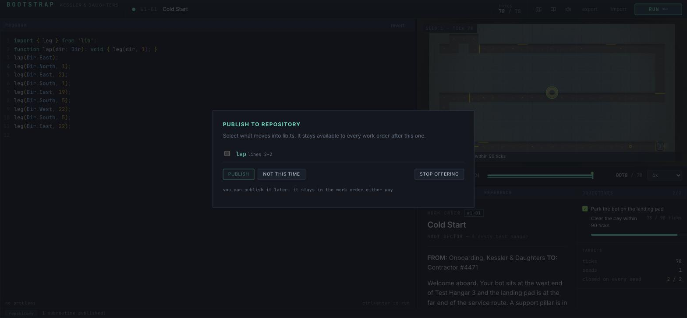
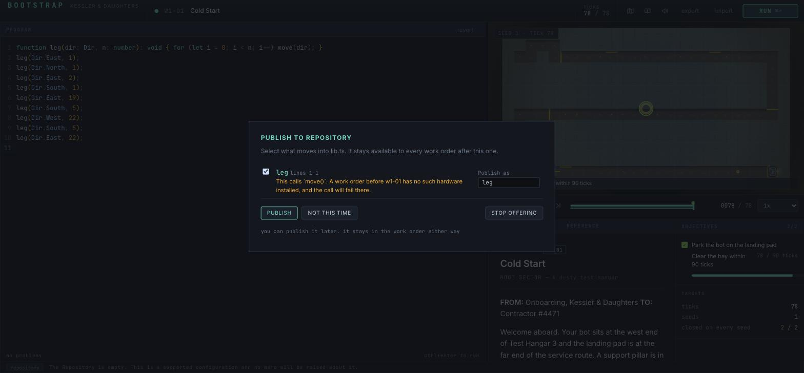
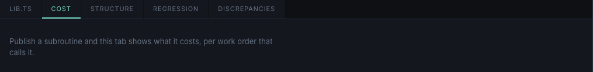

# FIX-PUBLISH-CRASH — the publish offer took the app to a black screen

`docs/AUDIT-UI.md` finding 21. The publish dialog could not be reached: opening it unmounted the
whole tree to `--bg-void`. This document is written as the work happened — archaeology first, then
the fix, then the extras.

---

## 1. Archaeology — when it broke, and from which commit

**It is a regression from today, and the commit is `befef62` (`fix: publish cannot silently
corrupt lib.ts`, 2026-09-05 12:18:29 +0200). It is unconditional from that commit onward.**

`src/meta/ui/PublishDialog.tsx` has exactly two commits in its history:

| commit | when | what it did to `selection` |
|---|---|---|
| `0a1b2a2` | 2026-09-04 23:58 | created the file. `useMemo(…, [picked, names])` |
| `befef62` | 2026-09-05 12:18 | rewrote the body to take the `uses` closure. `useMemo(…, [offer, picked, names])` |

The half of the cycle that lives in the store — `setSelection` minting a **new** `offer` object on
every call — has been there since `0a1b2a2` and is **unchanged to this day**:

```js
setSelection(selection) {
  const offer = get().offer;
  if (!offer) return;
  set({ offer: { ...offer, selection } });   // new identity, every call
},
```

That was harmless for twelve and a half hours, because the thing that read it back — the
`selection` memo — was derived only from component-local state (`picked`, `names`). The trap was
laid on day one; nothing had stepped in it yet.

`befef62` stepped in it. It changed the memo's body from `[...picked]` to
`closureOf(offer?.declarations ?? [], [...picked])` and, correctly for the new body, added `offer`
to the dependency list. From that moment the cycle closes:

```
render → selection memo (deps include offer) → effect setSelection(selection)
       → store set({ offer: { ...offer, selection } }) → new offer identity
       → useSyncExternalStore re-render → memo recomputes → new selection array
       → effect deps changed → setSelection → …
```

There is no exit. `closureOf(...).map(...)` allocates a fresh array on every pass, so the effect's
dependency compares unequal every pass even when the player has ticked nothing and the selection is
empty. React counts the nested updates, throws `Maximum update depth exceeded`, and with no
boundary above the modal layer the throw takes the tree with it.

**Unconditional, not conditional.** It does not depend on what the player ticked, on the shape of
the save, or on how many declarations the work order offers. The only precondition is that the
dialog mounts at all — that is, that `offerPublish` set an offer, which needs `unlocked && briefed`,
no mute, no prior decline for that level, and at least one callable declaration. Every one of those
guards is about *reaching* the dialog. Once reached, it always crashes.

**Why the playtests are not evidence against this.** `docs/PLAYTEST-BEGINNER.md` was committed at
11:04 and `docs/PLAYTEST-VETERAN.md` at 11:13 — **both before `befef62` at 12:18**. At the time
both playtesters ran, `PublishDialog.tsx` was still the `0a1b2a2` version with the memo on
`[picked, names]`, and the dialog worked exactly as the veteran describes it: nineteen checkboxes
on `w4-04`, a publish at `w4-02`, a truncated arrow function in `lib.ts`. `befef62` is the commit
that answered those two findings — its message says so: "offers only callable declarations
(19 -> 11 on w4-04)" and "ticking a routine takes its transitive uses closure with it" — and in
answering them it closed the cycle. **The fix for the playtest's publish complaints is what broke
publishing.**

One inconsistency worth recording rather than hiding: `PLAYTEST-VETERAN.md` §5 quotes the closure
notice ("This also uses `found`, `opposite`, `seen`, which would stay behind"), which is
`PUBLISH.brings`, and that copy did not exist until `befef62`, an hour after the report was
committed. Either the report was written against an unmerged branch or that paragraph is
anticipatory. It does not change the dating: the file the playtesters could have been running had
no `offer` in the memo, and there is no version of history in which the crashing code existed at
11:13.

**Today's other two publish commits are not the cause.** `c098634` (14:16, the delivery-note
ceremony) added the `briefed` guard to `offerPublish`, and `299622d` (16:37, the publish notice)
added `reviewForPublish` and the `published.length === 0` guard. Both changed *whether the offer is
raised*; neither touched `setSelection`, the memo or the effect. They narrow the door; they are not
the hole behind it.

**Baseline before any change here:** 1665 tests across 66 files, green.

---

## 2. The fix — the selection was never part of the offer

**Chosen: `PublishOffer` loses its `selection` field, and `confirmPublish` takes the selection as
an argument.** The dialog owns the draft in component state and hands it over once, on the click
that publishes. `offer` is now write-once for its whole life — `offerPublish` mints it,
`confirmPublish` and `skipPublish` clear it, and nothing in between ever replaces it.

```diff
 export interface PublishOffer {
   levelId: string;
   code: string;
   declarations: Declaration[];
-  selection: PublishSelection[];
 }
-  setSelection(selection: PublishSelection[]): void;
-  confirmPublish(): Promise<void>;
+  confirmPublish(selection: PublishSelection[]): Promise<void>;
```

```diff
-    setSelection(selection: PublishSelection[]): void {
-      const offer = get().offer;
-      if (!offer) return;
-      set({ offer: { ...offer, selection } });
-    },
-
-    async confirmPublish(): Promise<void> {
+    async confirmPublish(selection: PublishSelection[]): Promise<void> {
       const { offer, save } = get();
       const active = requireHost();
-      if (!offer || offer.selection.length === 0 || !active) return;
+      if (!offer || selection.length === 0 || !active) return;
```

and in the dialog, the effect and its store subscription go entirely; the button carries the
selection:

```diff
-  const setSelection = useLibrary((state) => state.setSelection);
-  useEffect(() => {
-    setSelection(selection);
-  }, [selection, setSelection]);
-            onClick={() => void confirm()}
+            onClick={() => void confirm(selection)}
```

Net: **twelve lines out, three in.** No new state anywhere, no comparison to keep in sync with
`PublishSelection`'s shape, and one fewer store write per keystroke in the rename field.

### Why the two alternatives leave the trap in place

**The audit's identity guard in `setSelection`** stops today's loop and nothing else. `offer` stays
a mutable object that the store replaces during a render commit; the guard is a hand-written deep
comparison over `PublishSelection`, so the day someone adds a third field to that interface the
guard silently stops guarding and the black screen comes back with no compiler error and no failing
test. It also does not help the *next* memo. `plan` is memoised on `[offer, selection, source]` —
under the guard, any `setSelection` call that does change the selection still mints a new `offer`
and re-runs `planPublication`, a full re-scan of the level source and `lib.ts`, once per keystroke
in the rename box. The guard treats the symptom at the one call site that happens to be lethal.

**Narrowing the memo to `offer.levelId` / `offer.declarations`** also stops today's loop, and it is
the more honest of the two, but it is a discipline rather than a structure. It requires every future
reader of `offer` to know that the object is quietly replaced under them and to destructure
defensively — the exact knowledge nobody had this morning, in a component whose author *correctly*
listed `offer` as a dependency of a memo that reads `offer`. `befef62` did the right thing by the
rules of hooks and got a black screen for it. A fix that asks the next author to do the wrong thing
by those rules is not a fix.

**`selection` does not belong inside `offer` at all**, which is the answer to the question the brief
asked. `PublishOffer` is a *fact*: this work order closed, here is the source it closed with, here
are the declarations in it. It is captured deliberately at one instant — its `code` field already
carries a comment explaining exactly that. The selection is a *draft*: what the player has ticked so
far, mid-interaction, changing on every keystroke. Storing a draft inside a frozen fact is what made
the fact stop being frozen. Nothing outside the dialog ever read `offer.selection` except the
confirm path, so an argument was always the right shape for it.

A middle option — keeping `setSelection` but writing to a sibling `selection` field on the store
rather than into `offer` — was rejected for the same reason: it is still a freshly allocated array
written into a store on every render commit, and it re-lays the identical trap for the first
component that ever subscribes to it.

### What did not change

- `offerPublish`'s guards are untouched, in order and in effect: `unlocked && briefed`,
  `publishMuted`, `publishDeclined.includes(levelId)`, and at least one `callable` declaration.
- `reviewForPublish` is untouched, including the `published.length === 0` guard that
  `docs/FIX-REWARDS.md` added so the notice stops once the habit has landed.
- `skipPublish(false)` still declines this work order only; `skipPublish(true)` still mutes for the
  rest of the game and is still reversible from the Repository panel.
- `planPublication`'s inputs are byte-identical; nothing about the rewrite, the closure or the
  refusals moved.
- No par, threshold, budget or objective was touched. Nothing character-count-shaped was added.
- `PublishOffer` is transient store state and has never been persisted, so no save-file shape
  changed and every save still loads.

---

## 3. The regression test

`src/meta/__tests__/publish-dialog.test.ts`, six tests.

The problem: vitest here runs on `environment: 'node'` with no jsdom, no `@testing-library/react`
and no budget for a new dependency — and a test that only asserts the dialog renders would have
passed against the crashing code on its first render, because the first render is fine. What
crashes is the *second, third and fiftieth*.

So the test brings its own React. `vi.hoisted` builds a hand-cranked renderer with real hook
semantics — slot-indexed `useState` / `useRef` / `useMemo` / `useCallback` / `useEffect`, `Object.is`
dependency comparison, effects flushed after the render that queued them — and `renderUntilStable`
renders the **real `PublishDialog`** against the **real store**, over and over, until a pass asks
for no further pass or it gives up at 25. `vi.mock('react')` puts the driver in front of the
component. zustand lives in `node_modules`, so its own `import React from 'react'` never sees that
mock; its eight-line React binding is therefore re-expressed over the driver's hooks. The store
itself is the real one throughout.

The assertion is on the pass count, not on anything the dialog draws. A component that settles
cannot run away; a component that runs away never settles. That is the same property React itself
checks when it throws `Maximum update depth exceeded`.

**Verified against the pre-fix code**, by checking `HEAD`'s `store.ts` and `PublishDialog.tsx` back
out under the new test file:

```
× an offer with nothing ticked settles at once   AssertionError: expected 25 to be 2
× ticking a routine settles too                  AssertionError: expected 25 to be less than 25
× the offer the dialog is reading is never replaced under it
                                                 expected {…} to be {…} // Object.is equality
✓ PUBLISH moves the ticked routine into lib.ts and closes the offer
✓ Not this time declines this work order only
✓ Stop offering turns the prompt off for the rest of the game
```

Three failures, and 25 is the give-up limit: the dialog never settled at any depth. After the fix
all six pass, and the untouched dialog settles in exactly **2** passes — one render, one more for
the effect that clears the tick state when a new offer arrives. That number is pinned rather than
bounded, so a future effect that adds a pass has to say so out loud.

The other three tests are coverage that did not exist before: `skipPublish` and `confirmPublish` had
**no test at all** in the repo. They press the dialog's own buttons, found by the label the player
reads on them, and assert that `lib.ts` received the routine, that "Not this time" declines only
that work order and leaves `w1-02` still offered, and that "Stop offering" mutes the rest of the
game. These pass before *and* after — they are there to pin the behaviour the brief says must not
change, now that the selection travels as an argument.

**Suite: 1671 tests across 67 files** (baseline 1665 / 66, plus these six). `npx tsc --noEmit` and
`npm run build` are clean; `npx eslint src` has only the documented pre-existing `rules-of-hooks`
false positive at `src/levels/world-5/__solutions__/w5-01.ts:32`.

---

## 4. In the browser — the screenshot the audit could not take

Dev server on `:5321` in this worktree, stopped by its own PID afterwards. Own tab, closed
afterwards. `bootstrap.library` seeded to exactly `emptyLibrary()`'s shape with
`unlocked: true, briefed: true`, then reloaded — the same canonical seed the audit used to
re-verify F21. All three `docs/FIX-VIEWPORT.md` §4 traps were respected: every measurement was
taken after a screenshot had forced a frame in the hidden tab.

The repro from the audit, step for step: `w1-01`, a program with a top-level
`function leg(dir: Dir, n: number)` plus the route, `Cmd+Enter`, closed at gold in 78 ticks, then
**Back to the program** — the click that used to blank the application.





The dialog renders, stays rendered, and remains interactive. Ticking `leg` opens the rename field,
prints the hardware warning (*"This calls `move()`. A work order before w1-01 has no such hardware
installed, and the call will fail there."*) and enables `PUBLISH`.
`document.getElementById('root').children.length === 1` throughout, and the console holds no React
error of any kind — no `Maximum update depth exceeded`, no boundary message.

**Publishing for real.** `PUBLISH` rewrote the work order to `import { leg } from 'lib';`, wrote
`export function leg(…)` into `lib.ts`, moved the status bar to `1 subroutine published.`, and left
the editor at `no problems`. Re-running the rewritten program still closes `w1-01` at **gold, 78
ticks** — the published routine works through the linker. The COST tab then shows
`leg — published from w1-01 · 1 work order · 9 calls · 78 ticks charged · 9 per call`.

**Both skip paths, on the real dialog.**

- **Not this time** → dialog closes, `publishDeclined: ["w1-01"]`, `publishMuted: false`. Closing
  `w1-01` again raises nothing. Root still mounted.
- **Stop offering** → dialog closes, `publishMuted: true`, `publishDeclined` untouched. Closing
  `w1-01` again raises nothing.

**And a guard confirmed in passing.** Between those two runs the work order had no top-level
callable left (the function had moved into `lib.ts`), so the offer correctly stayed silent — and
the *notice* stayed silent too, because `published.length > 0` by then. That is
`docs/FIX-REWARDS.md`'s "the message is the habit, and by then the message has landed", working.

**One pre-existing error observed, not mine.** `src/ui/library.ts:90` logs
`Uncaught (in promise)` from `installTypes` on level entry — `docs/AUDIT-UI.md` F20, indexed to
`src/ui/library.ts`. It is unrelated to publishing and outside this agent's files.

---

## 5. The two extras from the same audit

Both are in `src/meta/**` and both were small. The parts of F12 and F13 that are **not** small were
left alone and are listed at the end.

### F13 — 37 red words about an empty folder

`NO_EXPORTS_WARNING` fired on `result.exports.length === 0` alone, which on a freshly provisioned
Repository means *always* — the starter `lib.ts` is four comment lines and `export {}`. The player
was told off in `--danger` red about a folder the ceremony had handed them seconds earlier, on the
same screen as a status line saying the state was fine.

Two changes, in `src/meta/ui/LibraryEditor.tsx` and `src/meta/copy.ts`:

- The line is owed only when it is **actionable** — when `lib.ts` holds a declaration and exports
  none of it (`publishableDeclarations(source).length > 0`). On an empty file: nothing.
- It is a `lib__note`, not a `lib__warn`. Not red.
- The copy is one sentence instead of two:
  *"lib.ts exports nothing. Add `export` to a declaration and any work order can import it."*

Verified in the browser both ways: silent on the fresh Repository, and — after deleting the
`export ` keyword from the published `leg` — present, dim, and correct.


### F12 — the duplicated empty-state sentence

The COST tab rendered `REFACTOR.empty` — *"The Repository is empty. This is a supported
configuration and no memo will be raised about it."* — the same sentence, word for word, that the
status bar prints 650px below it on the same screen. The status bar's copy stays (it is the line
`docs/FIX-LIBRARY-MOMENT.md` §4 is about); the tab now says what it will show once it has
something.



Also on F12, one line: the `lib.ts` Monaco now carries `ariaLabel: 'lib.ts'`. The program's editor
stays mounted behind the Repository panel, so the accessibility tree held **two** textboxes both
named "Editor content". Only one of them is mine; naming the other is in `src/ui/**`.

### Left alone, deliberately

- **F12's actual proposal — `program` as a sixth tab in the Repository's tab strip.** That is a
  workspace layout change in `src/ui/**`, which another agent holds. It is also not small: the
  Repository panel currently replaces the editor column wholesale, and making the program a peer
  tab means moving who owns that column.
- **F11 (`--ink-dim` fails AA) and F13's contrast half.** `src/ui/styles/tokens.css`. Not mine.
- **F20 (`installTypes`' rejected promise).** `src/ui/library.ts`. Not mine; observed live, see §4.

## Changes for the orchestrator to apply

Nothing outside `src/meta/**` was touched, and nothing outside it is required by this fix. Two
observations for whoever routes the rest of `docs/AUDIT-UI.md`:

1. **The error boundary over the modal layer (F21's third change) is still owed.** It was routed to
   the `src/ui/App.tsx` agent. It is worth keeping even though the loop is gone: `<Results />`,
   `<PublishDialog />`, `<RepositoryIssue />`, `<Requisition />` and `<ReviewMemo />` all still
   render bare, and a throw in any of them still deletes the site map and the player's unsaved code
   from the screen.
2. **F20 is live on `main`** — `src/ui/library.ts:90` throws an unhandled rejection on every level
   entry. Two of them were logged during this session's browser check.
